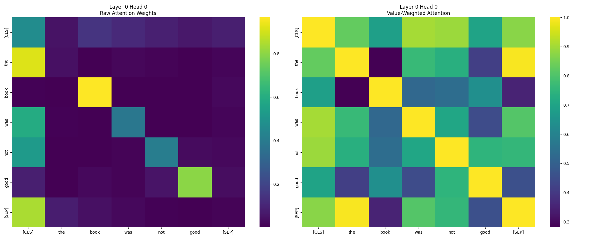
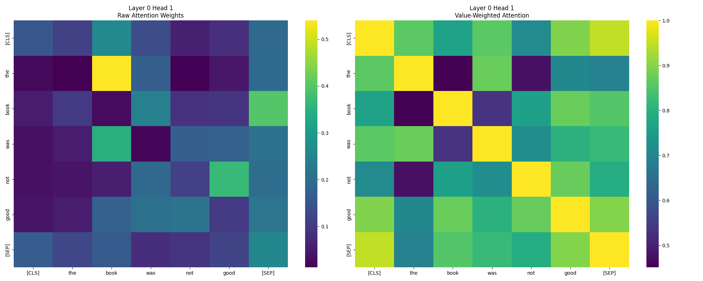
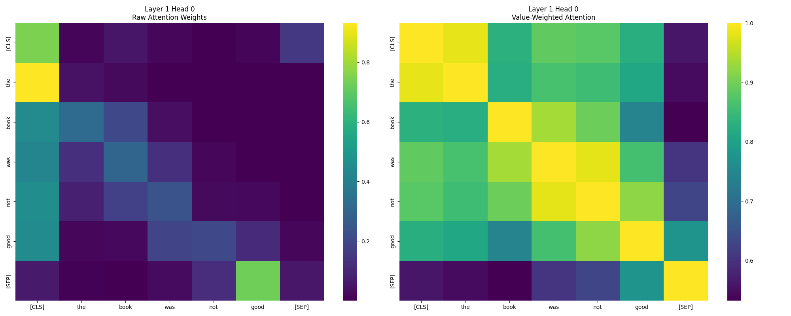
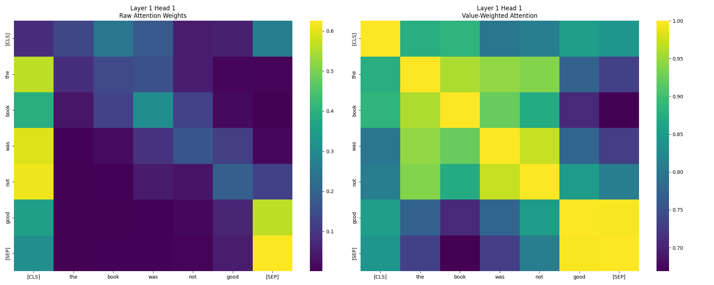

# Mechanistic interpretability of tiny models

This project provides tools for analyzing attention mechanisms. It enables detailed investigation of how attention patterns and value transformations change when semantically related but meaningfully different statements are processed.

Please note that this project is not complete and only my scratchbook to understand the mechanisms better

## Features

- Attention pattern visualization before and after value matrix transformation
- Counterfactual analysis comparing attention patterns between related statements
- Statistical metrics for quantifying attention pattern differences
- Support for both raw attention weights and value-weighted attention analysis
- Layer-wise and head-wise analysis capabilities

### Requirements

- PyTorch
- Transformers
- Seaborn
- Matplotlib
- NumPy

## Negation analysis

This investigates how transformer-based language models process negation through attention mechanism analysis. Using a custom AttentionProbe class, we visualize and analyze attention patterns and value-weighted attention across different layers and heads. The model used here is TinyBert (https://huggingface.co/prajjwal1/bert-tiny)

### Method

The analysis uses a custom AttentionProbe class that:

1. Extracts attention weights and value matrices from transformer layers
2. Computes value-weighted attention patterns
3. Visualizes results using heatmaps for both raw attention and value-weighted attention

The analysis is done for multiple negation statements and are observed as statistical objects to find patterns and circuits.

### Key findings

1. Layer specialization:

- Layer 0: Focuses on local token relationships
- Layer 1: Handles broader semantic connections

2. Negation processing:

- Strong bidirectional attention between negation words and affected terms
- Distinct value-weighted patterns in negation contexts
- Diffusion of value-weighted vectors around the negation term

### Results

- Raw attention weights: Shows direct attention patterns between tokens
- Value-weighted attention: Reveals semantic relationships after value transformation
- Analyzed across multiple layers and attention heads

#### Layer 0 Head 0

Left: Raw attention weights showing local token relationships
Right: Value-weighted attention revealing semantic connections

#### Layer 0 Head 1

Left: Raw attention with broader distribution
Right: Value-weighted patterns showing cross-token semantic relationships

#### Layer 1 Head 0

Left: Raw attention focused on syntactic relationships
Right: Value-weighted attention showing refined semantic connections

#### Layer 1 Head 1

Left: Raw attention with strong endpoint connections
Right: Value-weighted attention showing integrated semantic relationships

## Counter factual analysis

Analysis of counter factual statements in a DistillBert model

### Visualization Components

The visualization includes four heatmaps:
1. Original statement attention weights
2. Counterfactual statement attention weights
3. Original value-weighted attention
4. Counterfactual value-weighted attention

### Statistical Metrics

- `max_attention_diff`: Maximum absolute difference in attention weights
- `mean_attention_diff`: Average absolute difference in attention weights
- `attention_pattern_correlation`: Correlation between original and counterfactual attention patterns
- `value_output_correlation`: Correlation between original and counterfactual value-weighted outputs

## References

- https://www.neelnanda.io/mechanistic-interpretability/othello
- https://github.com/karpathy/nanoGPT
